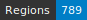
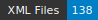

HTRomance, Medieval French corpus of ground-truth for Handwritten Text Recognition
  and Layout Segmentation
=====================
   

<!-- Custom Zone -->

## Introduction

This ground-truth dataset has been carefully built around the idea of having generic data for building a strong and reliable model for HTR of Latin manuscripts. Each manuscript should have around 10 columns (5 bi-columns pages or 10 pages of single column).

Data follow the Segmonto guidelines.

> [!NOTE]
> The repository contains two XML files per image. The ones suffixed with `.chocomufin.xml` are normalized in order to be compliant with other datasets following the same guidelines. The others are more specific to this repository. We recommend using the normalized documents.

## Credits

- Transcriptions: Noé Leroy
- Supervision and manuscript selection: Ariane Pinche & Jean-Baptiste Camps.
- Project management: Thibault Clérice & Alix Chagué.

<!-- Rien ne doit être modifié manuellement après la balise Start Auto -->

<!-- Start Auto -->

## Transcription guidelines

The transcription guidelines are described in a paper available on [HAL](https://hal-enc.archives-ouvertes.fr/hal-03828353) and published at the Journal for Open Humanities Data. It provides specific details about the selection process, the transcription methods and choices, as well as details about output (mainly the [Generic CREMMA Model for Medieval Manuscripts (Latin and Old French)](https://zenodo.org/record/7234166#.Y7f69afMJhE) for [Kraken](https://kraken.re))

## Data

ALTO and images can be found in the directory data. Each subfolder of data corresponds to a 
single manuscript, identified by its bookshelf.

<!-- BeginTable -->

| Shelfmark                                                                | Folder                                           | Biblissima                                    | Range       | Type   |   Century | Color   |   Main Zones |   Lines |   Characters | Genre            | Content                                                   |
|--------------------------------------------------------------------------|--------------------------------------------------|-----------------------------------------------|-------------|--------|-----------|---------|--------------|---------|--------------|------------------|-----------------------------------------------------------|
| [BnF NAF 23686](https://gallica.bnf.fr/ark:/12148/btv1b8446925z)         | [🔗](medieval-french/data/bnf-naf-23686)         | [→](https://data.biblissima.fr/w/Item:Q68314) | 112ra-114rb | prose  |        13 | ✓       |           10 |     424 |        17817 | légendier        | Vie de saint Alexis                                       |
| [BnF fr. 1635](https://gallica.bnf.fr/ark:/12148/btv1b105253083)         | [🔗](medieval-french/data/bnf-fr.-1635)          |                                               | fol. 4v-5v  | vers   |        13 | ✓       |            7 |     219 |         4838 | Fabliau          | Testament de l'âne                                        |
| [BnF fr. 12603](https://gallica.bnf.fr/ark:/12148/btv1b104673329)        | [🔗](medieval-french/data/bnf-fr.-12603)         | [→](https://data.biblissima.fr/w/Item:Q46033) | 203ra-205ra | vers   |        13 | ✓       |           16 |     442 |        14126 | chanson de geste | Fierabras                                                 |
| [BnF fr 2173](https://gallica.bnf.fr/ark:/12148/btv1b10022504n)          | [🔗](medieval-french/data/bnf-fr-2173)           | [→](https://data.biblissima.fr/w/Item:Q48587) | 96r-97v     | vers   |        13 | ✓       |            8 |     240 |         5269 | Fabliau          | La Mal Honte                                              |
| [BnF fr 19152 f°120va](https://gallica.bnf.fr/ark:/12148/btv1b52513419n) | [🔗](medieval-french/data/bnf-fr-19152-f°-120va) | [→](https://data.biblissima.fr/w/Item:Q48011) | 120vd-122rc | vers   |        13 | ✓       |           13 |     529 |        11087 | Fabliau          | C'est li Romanz des Braies                                |
| [BnF fr. 12615](https://gallica.bnf.fr/ark:/12148/btv1b60007945)         | [🔗](medieval-french/data/bnf-fr.-12615)         | [→](https://data.biblissima.fr/w/Item:Q46037) | 230v-231r   | vers   |        13 | ✓       |            5 |      62 |         3336 | chansonnier      | chansonnier de Noailles _ Chanson d'amour d'Adam le bossu |
| [BnF arsenal Ms-3525](https://gallica.bnf.fr/ark:/12148/btv1b550008195)  | [🔗](medieval-french/data/bnf-arsenal-ms-3525)   | [→](https://data.biblissima.fr/w/Item:Q34101) | 88v-91v     | vers   |        14 | ✓       |           18 |     185 |         4377 | Fabliau          | Dit des trois Dames de Paris_                             |
| [BnF fr. 619](https://gallica.bnf.fr/ark:/12148/btv1b55006072j)          | [🔗](medieval-french/data/bnf-fr.-619)           | [→](https://data.biblissima.fr/w/Item:Q51833) | 1ra-4vb     | prose  |        14 | ✓       |           12 |     356 |        11147 | traité de chasse | Gaston Phébus, Livre de chasse                            |
| [BnF fr. 13568](https://gallica.bnf.fr/ark:/12148/btv1b8447868p)         | [🔗](medieval-french/data/bnf-fr.-13568)         | [→](https://data.biblissima.fr/w/Item:Q46377) | 1r-5r       | prose  |        14 | ✓       |           10 |     199 |         3371 | Mémoire          | Mémoires de Froissart                                     |
| [BnF fr. 11610](https://gallica.bnf.fr/ark:/12148/btv1b8451110g)         | [🔗](medieval-french/data/bnf-fr.-11610)         | [→](https://data.biblissima.fr/w/Item:Q45651) | 1r-4r       | prose  |        15 | ✓       |           10 |     167 |         5435 | roman            | Roman du comte d’Artois.                                  |

<!-- EndTable -->

## Metrics

<!-- StartMetric -->

### Regions

- MainZone (109)
- NumberingZone (18)
- DropCapitalZone (95)
- RunningTitleZone (6)
- Not specified (5)
- MarginTextZone (11)
- DecorationZone (11)
- QuireMarksZone (1)
- MusicZone (6)
- text (5)
- StampZone (2)

### Lines

- DefaultLine (2808)
- HeadingLine (6)
- InterlinearLine (1)
- Not specified (8)

<!-- EndMetric -->

## Funding

This project was funded by the Bibliothèque nationale de France through the 2022 project calls from
[Datalab](https://www.bnf.fr/fr/bnf-datalab).

## Citer le projet

> Clérice, T., Chagué, A., Gille-Levenson, M., Brisville-Fertin, O., Pinche, A., Camps, J., Fischer, F., Boschetti, F., Guadagnini, E., Guilhem Couffignal, G., Canteaut, O., Romary, L., Reboul, M., Perreaux, N., Poibeau, T., & Smith, M. *HTRomance* [Data set]. https://htromance-project.github.io/

```
@misc{Clerice_HTRomance,
author = {Clérice, Thibault and Chagué, Alix and Gille-Levenson, Matthias and Brisville-Fertin, Olivier and Pinche, Ariane and Camps, Jean-Baptiste and Fischer, Franz and Boschetti, Federico and Guadagnini, Elisa  and Guilhem Couffignal, Gilles and Canteaut, Olivier and Romary, Laurent and Reboul, Marianne and Perreaux, Nicolas and Poibeau, Thierry and Smith, Marc},
title = {{HTRomance}},
url = {https://htromance-project.github.io/}
}
```

## Infrastructure

This project was produced through the [CREMMA infrastructure](https://www.dim-map.fr/projets-soutenus/cremma/).

